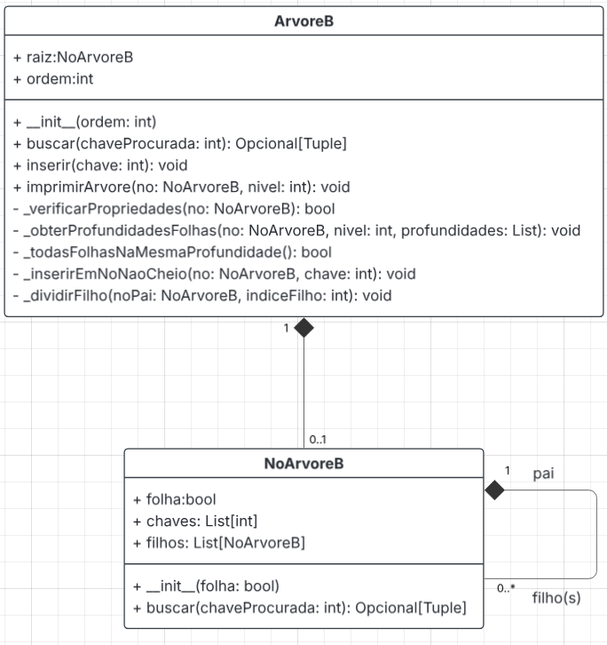

# Implementação de Árvore-B com Design by Contracts

### FGA0242 - Técnicas de Programação para Plataformas Emergentes

**Professor:** [André Lanna](https://github.com/andrelanna)

-----

## 1. Visão Geral do Projeto

Este projeto consiste na implementação da estrutura de dados **Árvore-B** (*B-Tree*) em Python 3, com um foco especial na aplicação de técnicas de **Programação por Contratos (Design by Contracts)**.

## 2. O Algoritmo Árvore-B

A Árvore-B é uma estrutura de dados de árvore auto-balanceada, otimizada para sistemas que lidam com grandes volumes de dados, como bancos de dados e sistemas de arquivos. Suas características principais incluem:

- **Balanceamento:** Todos os nós folha se encontram no mesmo nível.

- **Nós com Múltiplas Chaves:** Os nós podem armazenar várias chaves e ter múltiplos filhos.

- **Ordem da Árvore:** Um delimitador `t` ou `ordem` define o número mínimo e máximo de chaves e filhos que um nó pode ter, garantindo que a árvore não se degenere.

- **Ordenação:** As chaves dentro de cada nó são mantidas em ordem crescente.

As operações primárias implementadas são **Busca**, **Inserção** e **Remoção** de chaves.

## 3. Tecnologias e Ferramentas

  * **Linguagem:** Python 3
  * **Paradigma:** Programação Orientada a Objetos
  * **Design by Contracts:** Biblioteca `icontract`

O uso da biblioteca `icontract` permite a definição formal dos contratos (invariantes, pré e pós-condições) diretamente no código através de decoradores.

## 4. Estrutura do Repositório

O código está organizado de forma modular para separar a implementação da estrutura de dados de sua execução:

- `noArvoreB.py`: Define a classe `NoArvoreB`, que representa um nó da árvore.

- `arvoreB.py`: Define a classe principal `ArvoreB` e implementa toda a lógica de busca, inserção e gerenciamento da árvore.

- `main.py`: Script principal utilizado para testar a estrutura de dados, demonstrando as inserções, buscas e a violação de contratos.

- `README.md`: Este arquivo.

- `assets/`: Diretório contendo imagens relacionadas.

## 5. Diagrama de classes



## 6. Como Executar o Projeto

### Pré-requisitos

Certifique-se de ter o Python 3 instalado. Você precisará instalar a biblioteca `icontract`.

```bash
pip install icontract
```

### Execução

Para rodar a demonstração e os testes, execute o script `main.py` a partir da raiz do repositório:

```bash
python3 main.py
```

O script irá criar uma Árvore-B.

## 7. Contratos Implementados

Conforme os critérios de avaliação do trabalho:

| Tipo | Descrição |
| :--- | :--- |
| **Invariante** | Todos os nós folha estão no mesmo nível. |
| **Invariante** | As chaves nos nós internos e folhas estão em ordem crescente. |
| **Pré-condição** | A chave a ser inserida não deve existir previamente na árvore. |
| **Pré-condição** | A chave a ser removida deve existir na árvore. |
| **Pós-condição**| O número de chaves em cada nó obedece aos limites de $t-1$ e $2t-1$. |
| **Pós-condição**| O número de filhos em cada nó obedece aos limites de $t$ e $2t$. |
| **Pós-condição**| O nível da árvore só pode aumentar ou diminuir em 1 após operações de divisão ou fusão na raiz. |

## 8. Autores

- [Danilo Tertuliano](https://github.com/DaniloCTM)
- [Luciano de Freitas](https://github.com/luciano-freitas-melo)
- [Luiz Pettengill](https://github.com/LuizPettengill)
- [Marcus Martins](https://github.com/marcusmartinss)
